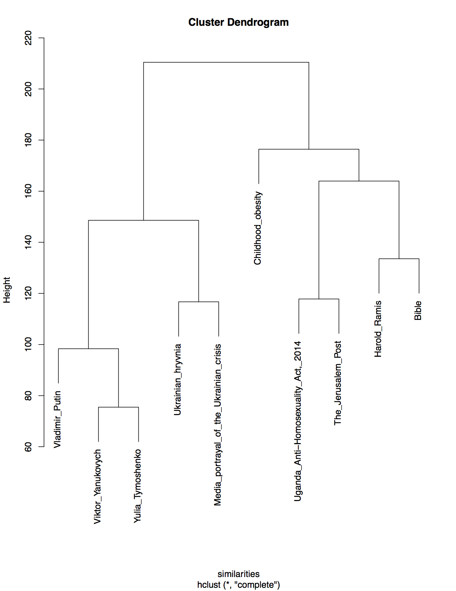
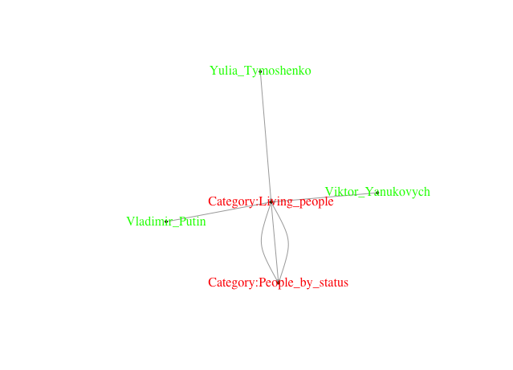
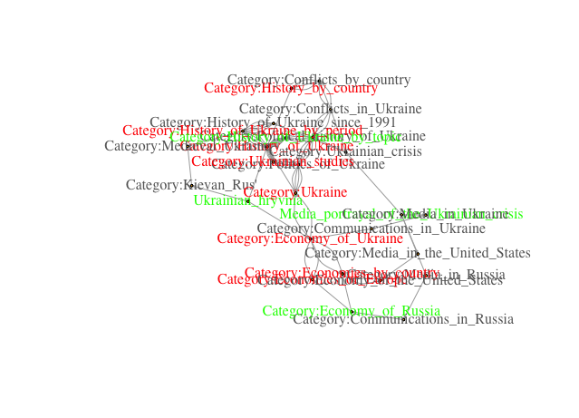
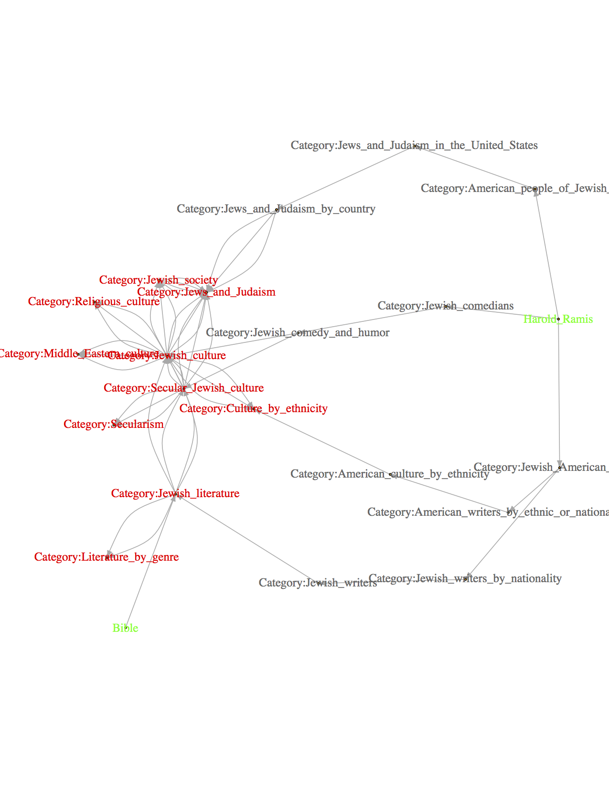
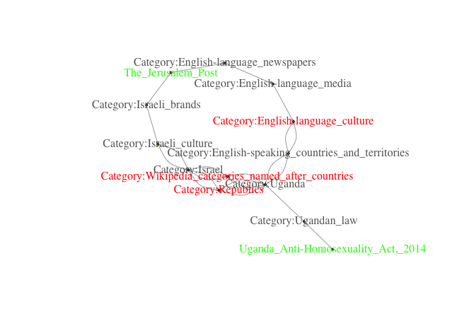

## Entity Relations

### Task
Use DBpedia entities to cluster tweets

### Approach

1. Induce entity subgraph: find relations between DBpedia entities in the DBpedia knowledge graph
2. Choose cluster labels: choose nodes in the knowledge graph used to cluster the input entities

### Results
* Hierarchical clustering of DBpedia entities

* Entity-relation subgraphs
    * Tymoshenko-Putin-Yanukovych

     
    * Hryvnia-Ukrainian_crisis

     
    * Bible-Ramis

     
    * Uganda-JerusalemPost

    

### TODO

* characterize entity relation subgraph
* separate common from spurious relations

### Related Work

#### Entity relations

1. [ESPRESSO (MPI)](http://espresso.mpi-inf.mpg.de/)

1.1 [ESPRESSO: Explaining Relationships between Entity Sets. S Seufert, K Berberich, SJ Bedathur, SK Kondreddi… CIKM, 2016](https://people.mpi-inf.mpg.de/~kberberi/publications/2016-cikm2016-2.pdf)

1.2. [Instant Espresso: Interactive Analysis of Relationships in Knowledge Graphs. Stephan Seufert, Patrick Ernst, Srikanta J. Bedathur, Sarath Kumar Kondreddi, Klaus Berberich, and Gerhard Weikum. WWW. 2016](http://www2016.net/proceedings/companion/p251.pdf)

* Pirro

#### Scalable graph mining
  * represent graph in vector space:
      * Percy Liang (Stanford)
      * graph2vec
      * subgraph2vec: Learning Distributed Representations of Rooted Sub-graphs from Large Graphs

  * precompute structure indices

      * Exploiting Network Structure for Active Inference in Collective Classification. Matthew J. Rattigan. ICDM.

  * graph summary
      * Stephane Campinas
