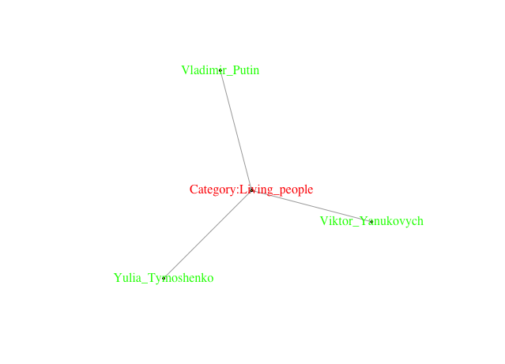
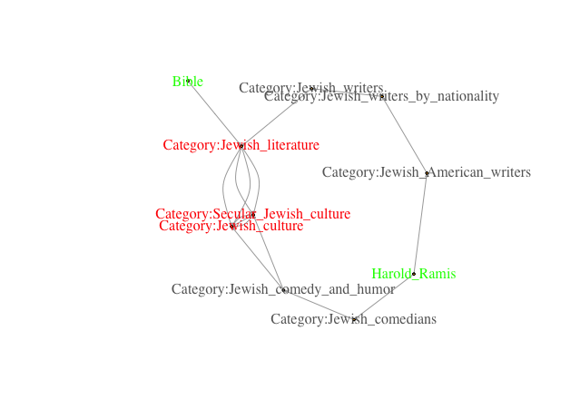

## Untangling Entity Relations in the Knowledge Graph

### Idea
Use Knowledge Graph (DBpedia) as a proxy for clustering (e.g. tweets) using entity linking.

### Approach

1. Induce entity subgraph: find relations between DBpedia entities in the DBpedia knowledge graph
2. Choose cluster labels: choose nodes in the knowledge graph used to cluster the input entities

### Results
* Hierarchical clustering of DBpedia entities

* Entity-relation subgraphs
    * Tymoshenko-Putin-Yanukovych
(depth: 1, cores: 1, symmetry: 1, paths: 1)
     
    * Hryvnia-Ukrainian_crisis (depth: 4, cores: 1, symmetry: 1/3, paths: 1)

     

    * Uganda-JerusalemPost (depth: 7, cores: 3, symmetry: [3/4, 3/4, 4/3], paths: 2, betweenness: Uganda)

    

    * Bible-Ramis (depth: 5, cores: 3, symmetry: [1/4, 2/3, 2/3], paths: 2, betweenness: Jewish_literature)

     

* Tymoshenko-Putin-Yanukovych full subgraph

min distance = 3 edges (Living people)
=> depth = 3/3 = 1 edge on average

max distance path = 114 edges (History of the Pacific Ocean)

|C| = 6,790 (cores/categories)

1. Induce subgraph with distance < 10: |V| = 98 |C| = 25
2. Remove terminal nodes |Q|=3 => connected components = 3

  - People (|V| = 3 = |C|, depth: [1, 2, 3], symmetry: 1, paths: 1)
  

  - Alumni_by_university_or_college_in_Europe (|V| = 6, |C| = 1, depth: 3, symmetry: 1, paths: 1)
  

  - Politics (|V| = 86)

### TODO

* separate common from spurious relations

### Related Work

#### Entity relations

1. [ESPRESSO (MPI)](http://espresso.mpi-inf.mpg.de/)

1.1 [ESPRESSO: Explaining Relationships between Entity Sets. S Seufert, K Berberich, SJ Bedathur, SK Kondreddi… CIKM, 2016](https://people.mpi-inf.mpg.de/~kberberi/publications/2016-cikm2016-2.pdf)

1.2. [Instant Espresso: Interactive Analysis of Relationships in Knowledge Graphs. Stephan Seufert, Patrick Ernst, Srikanta J. Bedathur, Sarath Kumar Kondreddi, Klaus Berberich, and Gerhard Weikum. WWW. 2016](http://www2016.net/proceedings/companion/p251.pdf)

* Pirro

#### Scalable graph mining
  * represent graph in vector space:
      * Percy Liang (Stanford)
      * graph2vec
      * subgraph2vec: Learning Distributed Representations of Rooted Sub-graphs from Large Graphs

  * precompute structure indices

      * Exploiting Network Structure for Active Inference in Collective Classification. Matthew J. Rattigan. ICDM.

  * graph summary
      * Stephane Campinas
